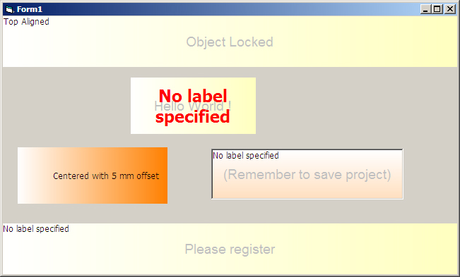



## Magic \(Gradient\) Label

### Description

Just another new kinda gradient smart label!

And don't forget to vote if you find this code useful !
 
### More Info
 
It's a control without particular effects, just to be efficent and slim !

No pictures allowed (i use another OCX of mine) and - at the moment - no rotation, even if api used permits (set angle degree to 0)

             |
---                |---
**Submitted On**   |2004-11-18 13:57:46
**By**             |[Fabio La Vitola](https://github.com/Planet-Source-Code/PSCIndex/blob/master/ByAuthor/fabio-la-vitola.md)
**Level**          |Intermediate
**User Rating**    |5.0 (10 globes from 2 users)
**Compatibility**  |VB 6\.0
**Category**       |[OLE/ COM/ DCOM/ Active\-X](https://github.com/Planet-Source-Code/PSCIndex/blob/master/ByCategory/ole-com-dcom-active-x__1-29.md)
**World**          |[Visual Basic](https://github.com/Planet-Source-Code/PSCIndex/blob/master/ByWorld/visual-basic.md)
**Archive File**   |[Magic\_\(Gra1824711232004\.zip](https://github.com/Planet-Source-Code/fabio-la-vitola-magic-gradient-label__1-57531/archive/master.zip)

### API Declarations

Just few api rquired, the usual API found everywhere !

